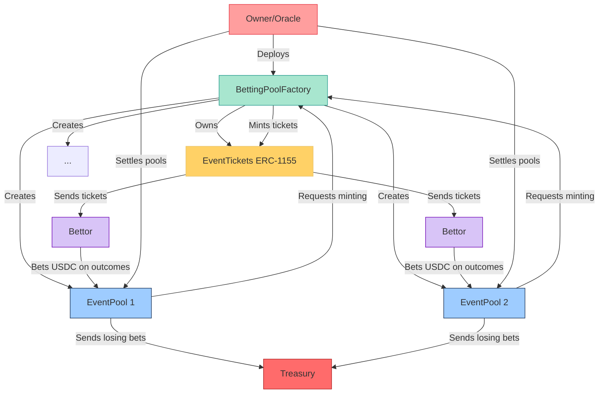

# ⚽ BetChain - Decentralized Sports Betting Protocol

Simple, secure betting where winners receive ERC-1155 tickets as proof of winning bets

## Architecture Overview



### Key Contract Relationships

1. **BettingPoolFactory (Owner)**  
   - Deploys and owns the `EventTickets` ERC-1155 contract
   - Creates `EventPool` instances for each betting event
   - **Can be transferred** to a DAO or multi-sig wallet using `transferOwnership()`
   - Acts as the **oracle** that settles pools and decides winners

2. **EventPool (Per-Event Contract)**  
   - Accepts USDC bets on 3 outcomes (Home/Draw/Away)
   - Stores all bets until settlement
   - When settled by owner:
     - Requests ticket minting for winners
     - Sends losing bets to treasury

3. **EventTickets (ERC-1155)**  
   - Mints unique tickets for each winning outcome
   - Ticket ID format: `keccak256(poolAddress + outcomeIndex)`
   - 1 ticket = 1 USDC winning bet (1:1 ratio)
   - Tickets are tradable NFTs

### Oracle/Owner Flexibility

- The **deployer starts as owner** but can transfer ownership via:

  ```solidity
  bettingPoolFactory.transferOwnership(newOwnerAddress);
  ```

- In production, this would be transferred to:
  - A multi-sig wallet (e.g., Gnosis Safe)
  - A DAO governance contract
  - A decentralized oracle network (future upgrade)
- The owner's **only critical role** is to call `settlePool()` with the correct outcome after events conclude

### Getting Started

```bash
# Set configuration variables (one-time)
npx hardhat keystore set USDC_ADDRESS
npx hardhat keystore set TREASURY_ADDRESS

# Deploy to any network
npx hardhat ignition deploy ignition/modules/DeployCore.ts --network mumbai

# Create a betting pool
npx hardhat run scripts/createPool.ts --network mumbai
```

> **Note**: This is a minimal MVP. The owner/oracle role is intentionally simple for university project scope. Production systems would add decentralized oracle networks and governance controls.
